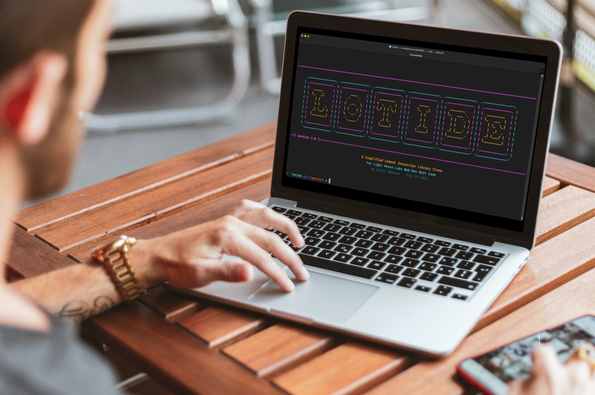

# LHL - Lotide Javascript Function Library
**Version 1.0**

The LHL Lotide project is inspired by the [Lodash](https://lodash.com/) project, which is a utility library for JavaScript. While Lodash itself is quite powerful, our version of it is simpler in order to focus on learning the fundamentals of programming and data management using JavaScript.

## Purpose

**This project was created and published by me as part of my learnings at Lighthouse Labs only.  It was published only for learning purposes. It is _not_ intended for use in production-grade software.**

---

## Lotide Included Fuctions:

### String Related:
- [x] countLetters.js
- [x] letterPositions.js

### Array Related:
- [x] eqArrays.js
- [x] countOnly.js
- [x] head.js
- [x] flatten.js
- [x] map.js
- [x] middle.js
- [x] tail.js
- [x] takeUntil.js
- [x] without.js

### Object Related:
- [x] eqObjects.js
- [x] findKey.js
- [x] findKeyByValue.js

## Assertion Functions:
- [x] assertArraysEqual.js
- [x] assertEqual.js
- [x] assertObjectsEqual.js

## Other Included Files:
- [x] index.js - all modules for easy inclusion in your projects
- [x] zTitle.js - simple ASCII art title page (no functionality)
- [ ] demo.js

## Getting Started:
**Install it from your project directory:**

`npm install @username/lotide`

**Require it in your .js file:**

`const _ = require('@username/lotide');`

**Call it within your .js file:**

`const results = _.tail([1, 2, 3]) // => [2, 3]`
## Usage:
Each Lotide function has it's own input parameters, and output (return) conditions.   It is encouraged that you review each Lotide library item to learn more about each function along with the required inputs and the expected outputs. 
